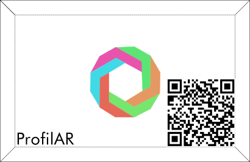
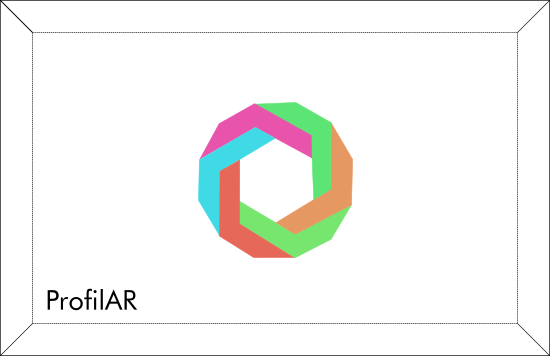

# ProfilAR 👁‍🗨

An application that allows you to display your own personal (personality) cards using AR.

Includes:
- Creating your own QR code for a personal (ProfilAR) card
- Scanning and checking out your own personal (ProfilAR) card
- Scanning other's personal cards and displaying it

## Instructions 💬

### QR code generator
1. Create your own QR code through QR code generator
2. Check out your own card by using QR code scanner
3. Move the camera to capture the whole card
4. Tap on the screen to display more details

### QR code scanner
1. Open QR code scanner
2. Scan the QR code first
3. Move the camera to capture the whole card
4. Details are shown on the card
5. Tap on the screen to display more details

## Examples 📷
An example of a ProfilAR card with QR:

An example of a ProfilAR template card:

***
## References
- [EasyAR](https://www.easyar.com/)
- [ZxingEasyAR](https://github.com/andvasconcel/ZxingEasyAR)

> Made as a project in the course **"Osnove oblikovanja" @ Univerza v Ljubljani - Fakulteta za računalništvo in informatiko**